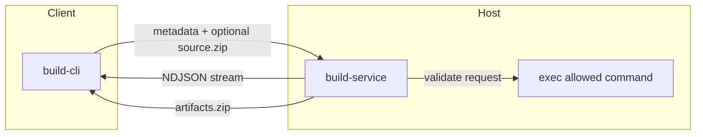

# Build Service

A build service that optionally accepts source uploads from clients, runs an allowed command on the host, streams NDJSON output, and optionally returns a single `artifacts.zip` that the client automatically extracts into the local workspace.

It can be used for builds that depend on proprietary host libraries that cannot be exposed inside containers, as well as for offloading builds to remote, more powerful servers or centralizing build tooling.

## ⚠️ Security Considerations

This service executes build commands on the host (or the configured run-as user). It includes basic guardrails, but it does not provide strong sandboxing. If a build script or Makefile reads or copies files outside the workspace and the service user has access, it can still access them. If that is a concern, run the service inside a container or a dedicated VM.

Built-in protections to review and tune:
- **Command allowlist** (`build.commands`)
- **Environment allowlist** (`build.environment.allow`)
- **Workspace scoping** (managed reusable workspaces or a configured default workspace, with relative path validation for sources/artifacts/cwd)
- **Transfer size and timeouts** (`sources.max_transfer_bytes`, `sources.max_uncompressed_bytes`, `build.timeouts`)
- **Transport controls** (socket permissions, optional HTTP auth)

If your environment includes untrusted or semi-trusted workloads, consider additional isolation around the service.

## Components

- **build-service**: host daemon. Validates requests, optionally extracts uploaded sources into a workspace, runs the configured command, streams output, and packages artifacts.
- **build-cli**: client that resolves config from CLI/env/config file, optionally packages sources, sends requests (HTTP or UDS), relays NDJSON output, and extracts artifacts when present.
- **build wrapper**: a POSIX shell shim that replaces build tools in containers.

## Architecture



## Build Flow

- You run `make` (or another tool) through the wrapper; it uses `build-cli` when `.build-service/config.toml` exists or `BUILD_SERVICE_ENDPOINT` is set.
- `build-cli` layers client settings as config file -> env vars -> CLI flags.
- If source patterns are configured, `build-cli` zips matching files and posts `metadata` + `source.zip`; otherwise it sends metadata only.
- The server resolves either a managed reusable workspace (`workspace.reuse = true`) or the configured `build.default_workspace_path`.
- The client streams stdout/stderr from NDJSON; on success the server emits `artifacts.zip` info only when artifacts were requested and collected.
- `build-cli` downloads and extracts `artifacts.zip` back into the local working tree only when the exit event includes artifacts.

## Non-Build Example

This service is not limited to build tools. If a command is whitelisted in `build.commands`, a remote client can upload input files and ask your local machine to run that command inside the configured default workspace.

One concrete example is previewing an HTML file with a local [`glimpseui`](https://github.com/hazat/glimpse) install while driving it from a remote shell on `srv`.

1. On your local machine, create a config that keeps everything under `/tmp/build-service` and whitelists `glimpseui`.

```toml
schema_version = "3"

[service.socket]
enabled = true
path = "/tmp/build-service/build-service.sock"
mode = "0660"

[service.http]
enabled = false

[build]
workspace_root = "/tmp/build-service/workspaces"
default_workspace_path = "/tmp/build-service/default"

[build.commands]
glimpseui = "/usr/local/bin/glimpseui"

[sources]
max_transfer_bytes = 134217728
max_uncompressed_bytes = 1342177280

[artifacts]
storage_root = "/tmp/build-service/artifacts"
```

2. On your local machine, create the directories and start `build-service`.

```bash
mkdir -p /tmp/build-service/default
mkdir -p /tmp/build-service/workspaces
mkdir -p /tmp/build-service/artifacts
build-service --config /path/to/build-service.toml
```

3. On your local machine, create a reverse Unix-socket tunnel so `srv` can reach your local daemon.

```bash
ssh -N -o ExitOnForwardFailure=yes -o StreamLocalBindUnlink=yes \
  -R /tmp/build-service.sock:/tmp/build-service/build-service.sock \
  srv
```

4. On `srv`, run `build-cli` against the forwarded socket and upload the HTML file you want to open locally.

```bash
build-cli \
  --endpoint unix:///tmp/build-service.sock \
  --source demo.html \
  glimpseui demo.html
```

What happens:
- `build-cli` on `srv` uploads `demo.html`
- your local daemon extracts it into `/tmp/build-service/default`
- your local machine runs the whitelisted command `glimpseui demo.html`

This same pattern works for other whitelisted local commands. The important constraint is that the daemon only executes commands listed in `build.commands`; the remote client cannot invoke arbitrary binaries.

## Configuration

Sample config: `config/config.toml`

Key fields:
- `schema_version`: config schema version (currently "3").
- `service.socket.*`: Unix socket enablement, path, optional group ownership, and mode.
- `service.http.*`: HTTP enablement, listen address, auth, and optional TLS.
- `build.workspace_root`: base directory for temp workspaces.
- `build.default_workspace_path`: optional permanent workspace used when no reusable workspace is requested; the server does not GC or clean this directory.
- `build.workspace.*`: defaults and GC settings for reusable workspaces.
- `sources.max_transfer_bytes`: max source archive size accepted by the server (default 128MB).
- `sources.max_uncompressed_bytes`: max total extracted source size accepted by the server (default 10x transfer limit).
- `build.run_as_user` / `build.run_as_group`: optional run-as user/group.
- `build.commands`: allowlist mapping `command` -> absolute binary path.
- `build.timeouts.*`: default timeout and max timeout.
- `build.environment.allow`: allowlist of environment variables passed to the build.
- `sources.*`: upload-side transfer and uncompressed-content limits for source archives.
- `artifacts.storage_root`: artifact storage root (per-build subdirs).
- `artifacts.max_transfer_bytes`: optional max artifact zip size per request.
- `artifacts.max_uncompressed_bytes`: optional max total uncompressed artifact content size per request.
- `artifacts.*`: TTL/GC settings for artifact retention.

Environment overrides:
- `BUILD_SERVICE_CONFIG`: alternate config path.
- `BUILD_SERVICE_LOG_LEVEL`: override `logging.level`.

## Repo-local Client Config

File: `.build-service/config.toml`

This file is optional. If it is absent, `build-cli` can run from CLI flags and `BUILD_SERVICE_*` env vars alone.

```toml
[sources]
include = ["**/*"]
exclude = [".git/**", ".build-service/**", "target/**"]

[artifacts]
include = ["out/**", "dist/*.tar.gz"]
exclude = ["**/*.tmp"]

[connection]
# enabled = true  # if false, skip build-service and run local tool
# endpoint = "unix:///run/build-service.sock"
# endpoint = "https://build.example.com"
# token = "..."
# local_fallback = false  # if true, fall back to local build when endpoint is unreachable

[request]
# optional defaults
# timeout_sec = 900
# cwd = "subdir"

[request.env]
CC = "clang"
CFLAGS = "-O2 -g"

[workspace]
# reuse = true
# id = "custom_id"   # supports {repo}, {branch}, and {uid} macros
# create = true
# refresh = false
# ttl_sec = 3600

[output]
# capture_logs = true
# log_dir = "captured-logs"  # relative to the directory where build-cli starts
# stdout_max_lines = 2000
# stderr_max_lines = 1000
# stdout_tail_lines = 50
# stderr_tail_lines = 50
```

Notes:
- `sources` and `artifacts` patterns must be relative and cannot use `..`.
- Source include patterns that match nothing are skipped.
- Source upload is optional. If no source include patterns are configured anywhere, the client sends metadata only.
- Artifact download is optional. If no artifact include patterns are configured anywhere, the client skips artifact download entirely.
- In env-only mode, source packaging and artifact extraction are rooted at the current working directory because there is no repo config root to anchor them.
- When `output.capture_logs = true`, `build-cli` writes complete stream transcripts to `<base>/<build_id>/stdout.log` and `<base>/<build_id>/stderr.log`. If `output.log_dir` is unset, `<base>` defaults to `std::env::temp_dir().join("build-service")`; if it is relative, it is resolved against the directory where the `build-cli` process starts.
- Output limits are optional and still apply only to terminal output; unset means unlimited, `0` disables output. When capture is healthy, the suppression notice points to the saved log path for that stream. If capture is unavailable, the CLI falls back to the existing env-var hint (`BUILD_SERVICE_STDOUT_MAX_LINES` / `BUILD_SERVICE_STDERR_MAX_LINES`) and later summarizes suppressed lines.
- When log capture initializes successfully, the CLI prints a final `stderr` notice with both saved log paths even if no suppression occurred.
- Temp-dir retention is OS-managed. If you rely on saved logs, set `output.log_dir` to a persistent location and clean up old build directories yourself.
- When workspace reuse is enabled, the CLI reads `.build-service/workspace-id` if no workspace id is configured and writes it when the server returns `workspace_id`.
- `workspace.id` and `BUILD_SERVICE_WORKSPACE_ID` support `{repo}`, `{branch}`, and `{uid}`; the CLI expands `{repo}` to the repo root directory name, `{branch}` to the current git branch, and `{uid}` to the effective user id, and the server sanitizes the resulting workspace id.
- Set `BUILD_SERVICE_WORKSPACE_REFRESH=true` to force a full resync of sources for the next build.
- Set `connection.enabled = false` (or `BUILD_SERVICE_ENABLED=false`) to force the wrapper to skip build-service and run the local tool. `BUILD_SERVICE_ENABLED` overrides the config when set.
- If no config file is found, `BUILD_SERVICE_ENDPOINT` or `--endpoint` is required.
- When a config file is present, endpoint resolution still falls back to `unix:///run/build-service.sock`.
- When `connection.local_fallback = true`, the wrapper falls back to the local command if the build service endpoint is unreachable.
- The configured default workspace is serialized behind a single lock; concurrent requests against it return `workspace_busy`.
- Endpoint must start with `http://`, `https://`, or `unix://`.
- HTTPS endpoints use the OS trust store at runtime, so `build-cli` honors system-installed CA certificates (including local intercepting proxy CAs).
- Connection precedence: CLI flags > env vars > `.build-service/config.toml`. With a config file present, the final fallback endpoint is `unix:///run/build-service.sock`.
- Source/artifact pattern precedence is additive: config file, then comma-separated env vars, then repeatable CLI flags.
- Env overrides: `BUILD_SERVICE_ENABLED`, `BUILD_SERVICE_ENDPOINT`, `BUILD_SERVICE_TOKEN`, `BUILD_SERVICE_SOURCES`, `BUILD_SERVICE_SOURCES_EXCLUDE`, `BUILD_SERVICE_ARTIFACTS`, `BUILD_SERVICE_ARTIFACTS_EXCLUDE`, `BUILD_SERVICE_CWD`, `BUILD_SERVICE_TIMEOUT`, `BUILD_SERVICE_STDOUT_MAX_LINES`, `BUILD_SERVICE_STDERR_MAX_LINES`, `BUILD_SERVICE_WORKSPACE_REUSE`, `BUILD_SERVICE_WORKSPACE_ID`, `BUILD_SERVICE_WORKSPACE_CREATE`, `BUILD_SERVICE_WORKSPACE_REFRESH`, `BUILD_SERVICE_WORKSPACE_TTL`.

## Protocol

### Start Build (multipart)
`POST /v1/builds` over TCP or Unix socket (HTTP over UDS)
`Authorization: Bearer <token>` when HTTP auth is enabled.

`multipart/form-data` parts:
- `metadata` (application/json)
- `source` (application/zip, optional)

Metadata JSON:

```json
{
  "schema_version": "3",
  "request_id": "<optional>",
  "command": "make",
  "args": ["-j4", "all"],
  "cwd": "subdir",
  "timeout_sec": 600,
  "artifacts": {"include": ["out/**"], "exclude": []},
  "env": {"CC": "clang"},
  "workspace": {"reuse": true, "id": "custom_id", "create": true, "ttl_sec": 3600}
}
```

### Response Stream (NDJSON)
Streamed as `application/x-ndjson` until exit.

```json
{"type":"build","id":"bld_123","status":"started"}
{"type":"stdout","data":"..."}
{"type":"stderr","data":"..."}
{"type":"exit","code":0,"timed_out":false,
 "workspace_id":"custom_id",
 "artifacts":{"path":"/v1/builds/bld_123/artifacts.zip","size":123456}}
```

Artifact patterns that match no files are skipped (logged at info level). If no files match any pattern, `artifacts` is `null` in the exit event.
For managed reusable workspaces, the exit event includes `workspace_id`. Builds that use the default workspace omit it.

### Artifact Download
`GET /v1/builds/{build_id}/artifacts.zip`

## Path Validation

- `cwd` and all glob patterns must be relative and cannot contain `..`.
- `-C`/`--directory` and `-f`/`--file` args are validated for `make` to prevent escapes.
- Source extraction and artifact paths are canonicalized to prevent traversal.

## Timeout Handling

On timeout:
1. Send `SIGTERM` to the process group
2. Wait 5 seconds
3. Send `SIGKILL` if still running
4. Emit `{"type":"exit","code":124,"timed_out":true}`

## Build and Install

Build locally:

```
cargo build --release
```

Install on host:

```
sudo cp target/release/build-service /usr/local/bin/
sudo mkdir -p /etc/build-service
sudo cp config/config.toml /etc/build-service/config.toml
sudo mkdir -p /var/log/build-service
sudo cp systemd/build-service.service /etc/systemd/system/build-service.service
sudo systemctl daemon-reload
sudo systemctl enable --now build-service
```

## CLI Usage

```
# Config-backed mode
build-cli make -j4 all
build-cli --timeout 1800 make clean all

# Env-only mode
BUILD_SERVICE_ENDPOINT=unix:///tmp/build-service.sock build-cli make -j4 all
build-cli --endpoint unix:///tmp/build-service.sock --cwd project cargo test
build-cli --endpoint unix:///tmp/build-service.sock --source 'src/**' --artifact 'dist/**' make

# HTTP
build-cli --endpoint https://builds.example.com --token <token> make -j4 all
```

Environment:
- `BUILD_SERVICE_ENDPOINT`: endpoint URL (`http://`, `https://`, or `unix://`)
- `BUILD_SERVICE_TOKEN`: bearer token (HTTP only)
- `BUILD_SERVICE_SOURCES` / `BUILD_SERVICE_SOURCES_EXCLUDE`: comma-separated source patterns
- `BUILD_SERVICE_ARTIFACTS` / `BUILD_SERVICE_ARTIFACTS_EXCLUDE`: comma-separated artifact patterns
- `BUILD_SERVICE_CWD`: request working directory relative to the remote workspace
- `BUILD_SERVICE_TIMEOUT`: timeout in seconds
- `BUILD_SERVICE_STDOUT_MAX_LINES`: override stdout line limit
- `BUILD_SERVICE_STDERR_MAX_LINES`: override stderr line limit

## Build Wrapper

Install the wrapper earlier in `PATH` than the real build tools:

```
cp scripts/build-wrapper.sh /usr/local/bin/build-wrapper
chmod 755 /usr/local/bin/build-wrapper
```

During deployment, symlink each build tool name to the wrapper (so the wrapper can detect the command name from `argv[0]`):

```
ln -s /usr/local/bin/build-wrapper /usr/local/bin/make
ln -s /usr/local/bin/build-wrapper /usr/local/bin/cargo
```

Ensure the real tools are still available later in `PATH` (for example in `/usr/bin`). The wrapper removes its own directory from `PATH` before falling back, so it will pick the system tool instead of re-invoking itself.

The wrapper runs `build-cli` with the command name it was invoked as (for example `make` or `cargo`) when either a repo-local config exists or `BUILD_SERVICE_ENDPOINT` is set. The wrapper falls back to the local command in two cases:
1. Neither `.build-service/config.toml` nor `BUILD_SERVICE_ENDPOINT` is present
2. `build-cli` exits with code `222` because build-service is disabled or the endpoint is unreachable with local fallback enabled

## Logging

Logs are written using `tracing` in a plain-text format. Configure log directory/rotation in `[logging]`.

## Notes

- Builds run as the service process user by default, or `build.run_as_user`/`build.run_as_group` if set.
- If the client disconnects, the service cancels the build and terminates the process group.
- Artifacts are bundled into `artifacts.zip` and extracted by the client only when requested and returned.
- Unix file permissions are preserved in both source and artifact archives.
